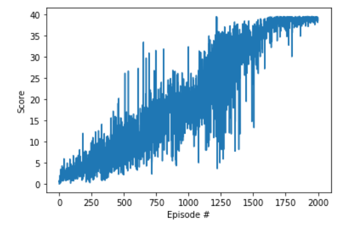
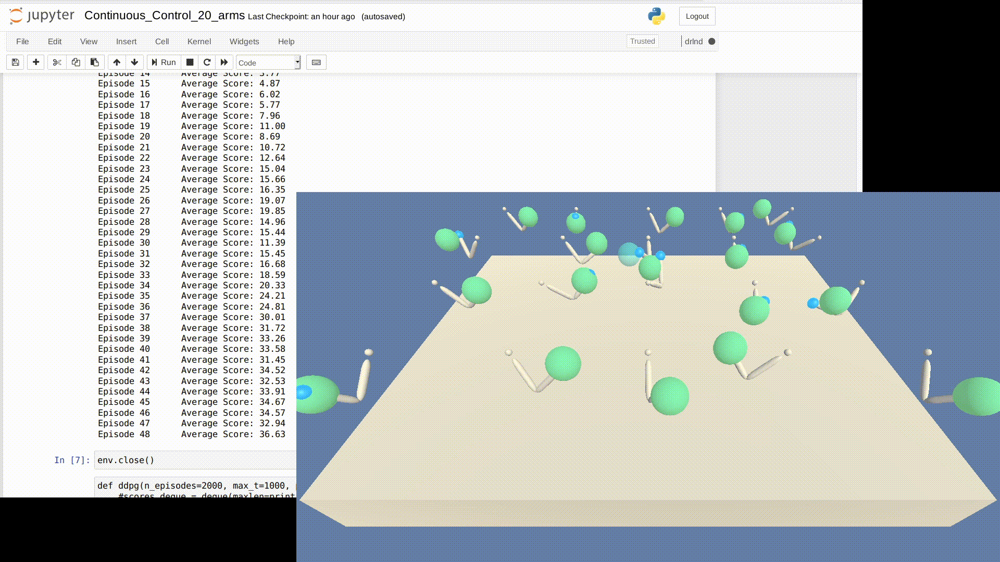
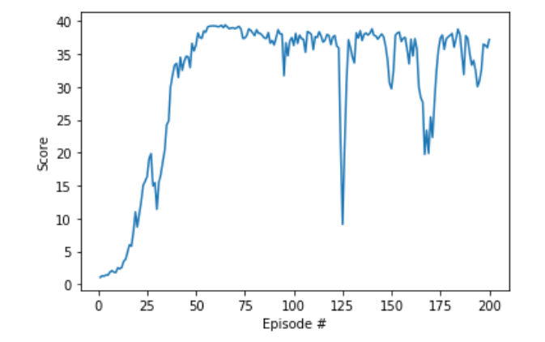

### Policy based methods
# Continuous control

### Context

This project shows the approach to teach an agent to solve continuous space problem of the Reacher environment, where the actions can take any value, on contrary to a discrete action-state space. For this project the Deep Deterministic Policy Gradient methods was used.

#### Deep Deterministic Policy Gradient (DDPG)

DDPG belong to the group of actor-critic methods. Actor-critic methods leverage the strengths of both policy-based and value-based methods. It uses a stochastic behaviour policy for exploration and uses an estimate deterministic target policy.

The DDPG method relies on two networks: a “critic”, that estimates the value function or state-value, and an “actor” that updates the policy distribution in the direction suggested by the critic. The actor directly maps states to actions instead of returning a probability distribution across a discrete action space.

The Policy Gradient method is the “actor” part of actor-critic method.

Deterministig Policy Gradient
 "In the stochastic case, the policy gradient integrates over both state and action spaces, whereas in the deterministic case it only integrates over the state space." [Silver et al. (2014)](http://proceedings.mlr.press/v32/silver14.pdf)

##### DDPG pseudo-algorithm
After [Lillicrap et al. (2016)](https://arxiv.org/abs/1509.02971):
- random initialization of actor and critic networks
- initialize target network
- initialize replay buffer
- for all episodes:
	- initialize a random process
	- receive initial observation state
	- for all time instances:
		- select action considering current policy and noise
		- execute action and collect reward and get new states
		- store the experience tuple to the replay buffer
		- sample an experience tuple from replay buffer - at random
		- set the target
		- update critic using the loss function
		- update the actor policy using the sampled policy gradient
		- update the target network


##### Resources
To learn more about actor-critic methods and DDPG I used the following reading resources:

- Continuous control with Deep reinforcement Learning [Lillicrap et al. (2016)](https://arxiv.org/abs/1509.02971)
- Deterministic Policy Gradient Algorithms [Silver et al. (2014)](http://proceedings.mlr.press/v32/silver14.pdf)
- [Patric Emami's blog article](https://pemami4911.github.io/blog/2016/08/21/ddpg-rl.html)
- [OpenAI Docs](https://spinningup.openai.com/en/latest/algorithms/ddpg.html)
- [Chris Yoon's blog article](https://towardsdatascience.com/deep-deterministic-policy-gradients-explained-2d94655a9b7b)
- [Markus Buchholz's blog article](https://medium.com/@markus.x.buchholz/deep-reinforcement-learning-deep-deterministic-policy-gradient-ddpg-algoritm-5a823da91b43)


### 1. Approach

I started out from the code for the ddpg-pendulum environment solution from the [udacity deep-reinforcement-learning repo](https://github.com/udacity/deep-reinforcement-learning/tree/master/ddpg-pendulum).
In the first steps I modified the environment specific variables from the openGym, to the udacity environment. For the solution of the environment I used the Deep Deterministic Policy Gradient (DDPG) algorithm.


### 2. Implementation
#### Modification of the neural network

##### Batch normalization
I added batch normalization to the NN, for both actor and critic classes.

```python
self.bn1 = nn.BatchNorm1d(fc1_units)
```

This alone did not improvement the score much. In addition, to overcome array dimensionality error in the forward pass, the states have to be "unsqueeze"-ed.
```python
if state.dim() == 1:
	state = torch.unsqueeze(state, 0)
```

##### Gradient clipping
The implementation of gradient clipping is via the `clip_grad_norm` method, and the it is placed after the `backward()` and the next step of the __critic__ optimizer in the `ddpg_agent.py` file [here](https://github.com/bkocis/DRLND_Pr_2_Continuous_Control/blob/master/ddpg_agent_Copy2.py#L119)

```python
torch.nn.utils.clip_grad_norm_(self.critic_local.parameters(), 1)
```

#### Modification to the agent

In the starting code implementation from the ddpg-pendulum example, additionally the Ornstein-Uhlenbeck and the Replay buffer (experience replay) have been already implemented. In addition I extended and modified the following aspects of the original code base:

##### Epsilon-greedy implementation

I also tried to implement to epsilon-greedy decay. The values of the noise is multiplied by the epsilon factor, which is decreasing after each step of the action method.


### 3. Environment solutions

I was wondering how much would the solution be different for the case of 1 and 20 agents. Therefore I tried to solve both environments. I first started with the 1 agent case. The environment with 20 agents differs only by a section of code that gathers the actions, states and rewards from all individual agents:


#### 1. Reacher with one agent


I used a network with 256 nodes for both the actor and critic. The parameter of `max_t` would be more 1000 or more. The environment was solved in 1330 episodes, and the plot is shown below:



The corresponding notebook is [Continuous_Control_1_arm.ipynb](https://github.com/bkocis/DRLND_Pr_2_Continuous_Control/blob/master/Continuous_Control_1_arm.ipynb)


#### 2. Reacher with __twenty agents__

The implementation of the agent and the model are the same as in the case of the one arm agent. The only difference is in the main (`ddgp()`) method.





The corresponding notebook is [Continuous_Control_20_arms.ipynb](https://github.com/bkocis/DRLND_Pr_2_Continuous_Control/blob/master/Continuous_Control_20_arms.ipynb)

<br>
<br>

### Hyperparameters used

The table list out the best set of parameters after many experiments:

| parameter | value |
| --- | --- |
| N nodes critic  | 256, 256|
| N nodes actor | 256, 256|
|BUFFER_SIZE replay buffer size | int(1e6)  |
|BATCH_SIZE minibatch size | 128        |
|GAMMA discount factor | 0.99            |
|TAU soft update of target parameters | 1e-3              |
|LR_ACTOR  learning rate of the actor | 1e-3         |
|LR_CRITIC learning rate of the critic| 1e-3     |
|WEIGHT_DECAY L2 weight decay | 0     |
|EPSILON  epsilon noise | 1.0        |
|EPSILON_DECAY decay rate for noise| 1e-6 |   
| sigma OUNoise | 0.2 |
| theta OUNoise | 0.15 |
| mu OUNoise | 0 |


### 4. Further improvements
- For the case of the one agent (one-arm-solution), the score plot is very fuzzy. It would be interesting to implement smoothed rewards by implementing other methods such as the A2C, or A3C, as shown in [this blog post](https://towardsdatascience.com/understanding-actor-critic-methods-931b97b6df3f)
- working with this example I concluded that the choice of the hyperparameters is crucial but not trivial. Further improvement of the solution (higher score and faster convergence) would require deeper exploration of the relation of network size and training of the agent.
- It would be interesting to try REINFORCE to solve this environment.

---
Note

Udacity Workspace restarts

In the beginning of the project I started working inside the Udacity Workspace environment. However, I noticed that restarting of the notebook takes too much time and toggling the GPU does not restart the environment of the workspace. I ended up spending a few days of not knowing where the problem lies.

Nvidia RTX

After I installed the environment on local computer with Nvidia 1050, the code implementation worked perfectly. I tested the code on Nvidia RTX 2080Ti as well. __In the case you  want to run the code on RTX cards, you should remove the pytorch 0.4 version that comes with the install of the [deep-reinforcement-learning](https://github.com/udacity/deep-reinforcement-learning) repo, and simply install the latest pytorch version.__ Prior to the reinstall of pytorch I encountered a problem, where the environment just did not want to run.
