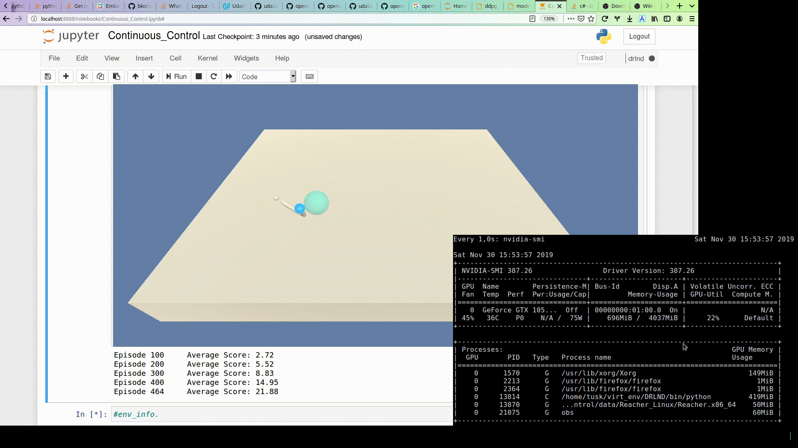
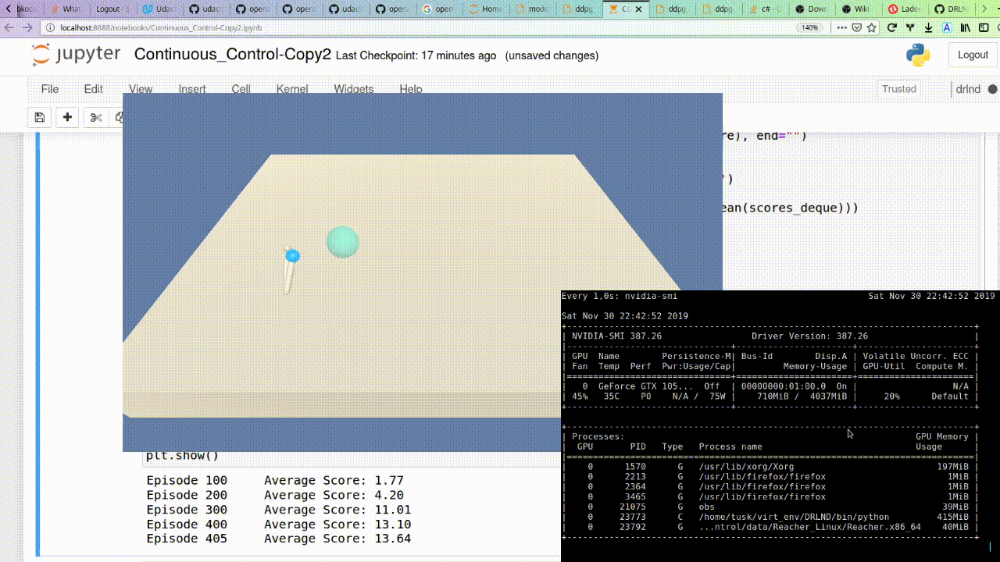

### Policy based methods
# Continuous control


1. Approach

1. Environments solved:

1. Reacher with __one agent__

	- started from the code of the ddpg pendulum environment form the official udacity repo
	- modified the environment setup from unity of udacity
	- run the training first bad results
	- added batch normalization to the model NN (both actor and critic class) got improvement but score still <3 (has to be >30 for 100 epochs)

	- this piece of code is needed after the implementation of the batch normalization in oder to overcome array dimensionality error.
	```python
        if state.dim() == 1:
            state = torch.unsqueeze(state, 0)
	```

	- added epsilon nose multiplier with a decaying factor

	- 


  - another solution is to increase the `max_t = 100000` parameter. In addition to this approach I reduced the number of nodes in the network layers to 256 256, instead the 400 and 300 nodes which were set for the pendulum environment. Smaller values of `max_t` in my experiments did not solve the environment.


1. Reacher with __twenty agents__

  The implementation of the agent and the model are the same as in the case of the one arm agent. The only difference is in the ddpg method.

  


__-- Note --__

I started working inside the Udacity Workspace environment. However, I noticed that restarting of the notebook takes too much time and toggling the GPU does not restart the workspace. I ended up spending a few days of not knowing where the problem lies.

After I installed the environment on local computer with Nvidia 1050, the code implementation worked perfectly.

I tested the code on Nvidia RTX 2080Ti as well. In the case you  want to run the code on this card, you should remove the pytorch 0.4 version, that comes with the install of the [deep-reinforcement-learning](https://github.com/udacity/deep-reinforcement-learning) repo, and simply install the latest pytorch version. Prior to the reinstall of pytorch I encountered a problem, where the environment just did not want to run.
