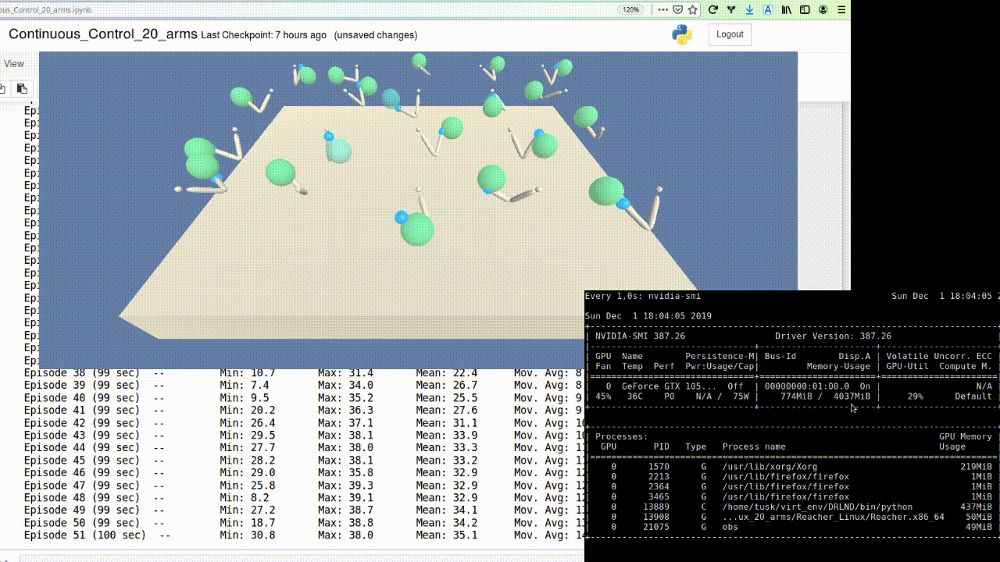

### Policy based methods
# Continuous control

### 0. Context

This project shows the approach to teach an agent to solve continuous space problems, where the actions can take any value, on contrary to a discrete action-state space.

### 1. Approach

I started out from the code for the ddpg-pendulum environment solution from the [udacity deep-reinforcement-learning repo](https://github.com/udacity/deep-reinforcement-learning/tree/master/ddpg-pendulum).
In the first steps I modified the environment specific variables from the openGym, to the udacity environment. For the solution of the environment I used the Deep Deterministic Policy Gradient (DDPG) algorithm.


#### Deep Deterministic Policy Gradient (DDPG)

DDPG belong to the group of actor-critic methods. Actor-critic methods leverage the strengths of both policy-based and value-based methods.

To learn more about actor-critic methods and DDPG I used the following reading resources:

- []()
- []()
- []()
- []()


### 2. Implementation
#### Modification of the neural network

##### Batch normalization
I added batch normalization to the NN, for both actor and critic classes.

```python
self.bn1 = nn.BatchNorm1d(fc1_units)
```

This alone did not improvement the score much. In addition, to overcome array dimensionality error in the forward pass, the states have to be "unsqueeze"-ed.
```python
if state.dim() == 1:
	state = torch.unsqueeze(state, 0)
```

##### Gradient clipping
The implementation of gradient clipping is via the `clip_grad_norm` method, and the it is placed after the `backward()` and the next step of the __critic__ optimizer in the `ddpg_agent.py` file [here](https://github.com/bkocis/DRLND_Pr_2_Continuous_Control/blob/master/ddpg_agent_Copy2.py#L119)

```python
torch.nn.utils.clip_grad_norm_(self.critic_local.parameters(), 1)
```

#### Modification to the agent

In the starting code implementation from the ddpg-pendulum example, additionally the Ornstein-Uhlenbeck and the Replay buffer (experience replay) have been already implemented. In addition I extended and modified the following aspects of the original code base:

##### Epsilon-greedy implementation

I also tried to implement to epsilon-greedy decay. The values of the noise is multiplied by the epsilon factor, which is decreasing after each step of the action method.


### 3. Environment solutions

I was wondering how much would the solution be different for the case of 1 and 20 agents. Therefore I tried to solve both environments. I first started with the 1 agent case. The environment with 20 agents differs only by a section of code that gathers the actions, states and rewards from all individual agents:


#### 1. Reacher with one agent


  - another solution is to use a smaller number of nodes in the network layers. I used values of 256 and 256 for both the actor and critic methods. The parameter of `max_t` would be more 1000 or more.

#### 2. Reacher with __twenty agents__

The implementation of the agent and the model are the same as in the case of the one arm agent. The only difference is in the ddpg method.




<br>
<br>
__Note__

Udacity Workspace restarts

In the beginning of the project I started working inside the Udacity Workspace environment. However, I noticed that restarting of the notebook takes too much time and toggling the GPU does not restart the environment of the workspace. I ended up spending a few days of not knowing where the problem lies.

Nvidia RTX

After I installed the environment on local computer with Nvidia 1050, the code implementation worked perfectly. I tested the code on Nvidia RTX 2080Ti as well. __In the case you  want to run the code on RTX cards, you should remove the pytorch 0.4 version that comes with the install of the [deep-reinforcement-learning](https://github.com/udacity/deep-reinforcement-learning) repo, and simply install the latest pytorch version.__ Prior to the reinstall of pytorch I encountered a problem, where the environment just did not want to run.
